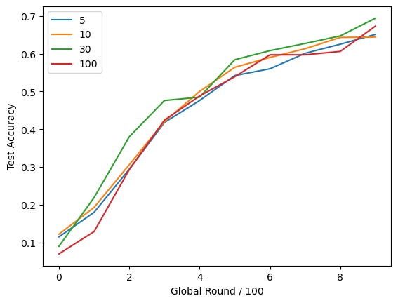
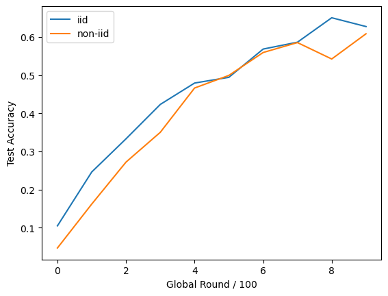

# 隐私保护学术报告

胡弈南，张仝旭

<!--s-->

## 现有进度分享

- 考察不同客户端采样数的精准度曲线
- 考察不同数据分布下精准度曲线

<!--v-->

### 客户端采样数

新模型为<font color='orange'>随机采样</font>的 n_client 个客户端的模型的平均值

能够有效降低通讯成本，但是会导致最终的模型产生偏倚

<center>
  
</center><!-- .element: class="fragment" -->

<!--v-->

### 数据分布

非独立同分布情况下，各本地模型训练差距较大，导致模型的聚合效果较差

<center>
  
</center>

<!--s-->

## 研究思路

- 分布问题：正则项
- 通讯成本问题：稀疏化
- 隐私问题：差分隐私
- 精确度问题：神经网络

<!--v-->

### 正则项

在损失函数上添加正则项，将本地模型约束在全局模型的一定范围内，缓解数据分布不同问题

$$L^\prime=L+\beta||W-W^g||$$

<!--v-->

### 稀疏更新

仅保留最大的一部分更新量，减少通讯成本，但会导致一定程度上误差的积累

$$[0.1\ 2\ -0.2]\to [0\ 2\ 0]$$

<!--v-->

### 隐私差分

部分隐私信息可以从模型中获取

在局部模型反馈至全局时，加入 $Lap(\frac{s}{\epsilon})$ 的噪声

<!--v-->

### 神经网络

demo 中的神经网络的精确度只能训练到不到 $70\%$ 的正确率

尝试增加神经网络层数、更换激活函数等

```py
class MNIST_2NN(nn.Module):
    def __init__(self):
        super(MNIST_2NN, self).__init__()
        self.linear1 = nn.Linear(784, 200)
        self.linear2 = nn.Linear(200, 200)
        self.linear3 = nn.Linear(200, 10)

    def forward(self, x):
        x1 = torch.relu(self.linear1(x))
        x2 = torch.relu(self.linear2(x1))
        y = self.linear3(x2)
        return y
```

<!--s-->

## 感谢聆听！
